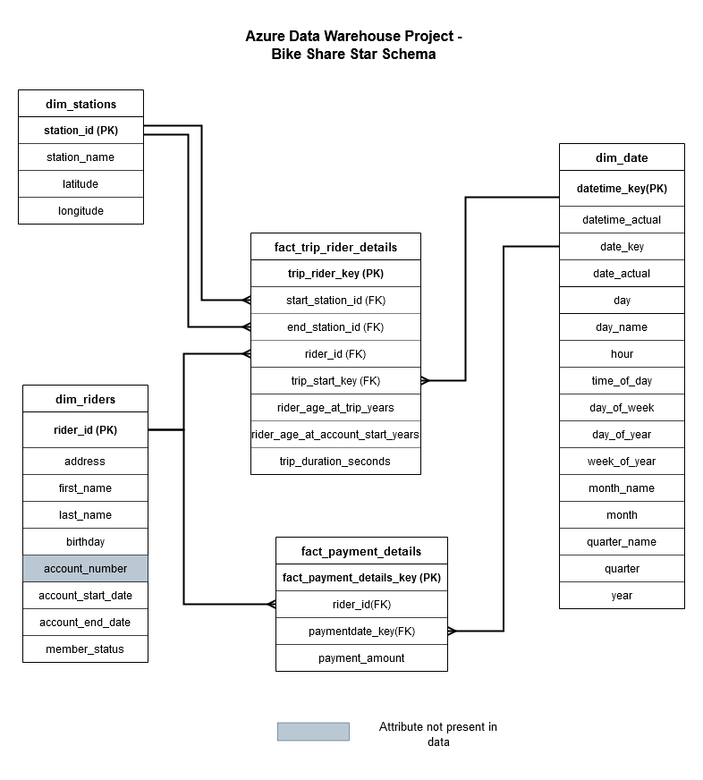

## Data Engineering ND - Project 04 Azure Data Lakehouse

### Schema Design  

This project uses a similar schema as the one used in the Data Warehouse project. A few unnecessary date dimension attributes  
have been dropped.  

The stations table was kept as is, to the dimStation table.
The Date dimension was created by generating hourly datetimes between the maximum and minimum of dates present in all  
the columns of the data.
The Rider dimension was created from the Rider table. The Account number field was absent from the data, however, in case
it was present, it would be part of the Rider dimension.
The Payment Details fact table was created using a JOIN between the payment and Rider table.
The Fact Trip Rider details consists of the RiderId, a Trip Start Key generated from converting the trip start date to
an integer format, and facts regarding the Trip, including the duration and the age of the rider at time of trip.  

Date and Time have been represented as a combined dimension, in order to avoid denormalizing. Kimball's architecture recommends
keeping the time dimension separate,  
however, doing so would no longer make the schema a star schema, but rather a snowflake schema.

Snake casing has been chosen for table names and attributes in the schema.
Delta Lake tables support only the [NOT NULL and CHECK CONSTRAINTS](https://docs.databricks.com/delta/delta-constraints.html).  

### Data Transformation
CSV files uploaded to the DBFS file system are first converted to bronze tables from the uploaded CSV file.
The spark.sql() method is used after export the dataframe to a temp view with createOrReplaceTempView().
With the use of joins and transformations with CAST(), date_format() and JOINs, the tables are converted to gold for suitability
for data analysis/machine learning.